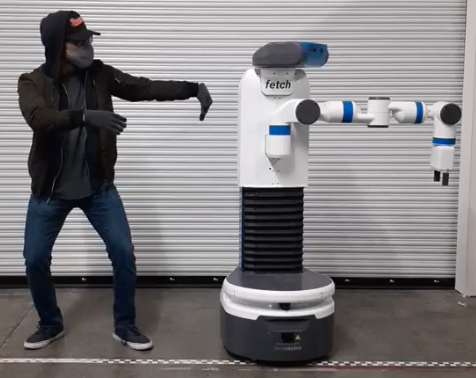

# Poppin Fetch: Dancing Robot 🎶🤖💃

Welcome to the **Poppin Fetch** project! In my spare time, I program a **Fetch manipulator robot** to create engaging dance routines using expressive motion. This project merges robotics and art, bringing life and personality to the robot through dance.

## About the Project

The Fetch Dance Bot leverages the **MoveIt!** open-source framework for advanced motion planning and control, allowing the robot to perform complex, fluid movements. I am currently working on **six new dance routines** that I plan to showcase by the end of the year. 

This project is one of my personal favorites, as it combines technical precision with artistic expression, showcasing the potential of robots to create expressive, captivating performances.

Videos can be found here: [Instagram Link](https://www.instagram.com/p/CJHvPiNnuZh/?hl=en)

<!-- ## Features

- **Expressive Motion**: Designed to make the robot's movements more engaging and lifelike.
- **Dance Routines**: Programmed routines that demonstrate the robot’s dexterity and expressiveness.
- **MoveIt! Integration**: Uses the powerful MoveIt! framework for precise and complex motion control. -->

